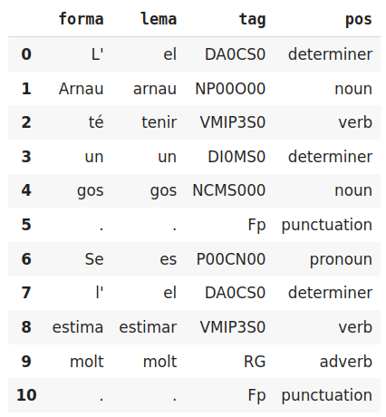

class: center, middle

## Processament del Llenguatge Humà

# Lab.3: nivell lèxic - morfologia

<br>

### Gerard Escudero

## Grau en Intel·ligència Artificial

<br>


---
class: left, middle, inverse

# Sumari

- .cyan[Documentació]

  - .cyan[Morfosintaxi i lematització]

  - Models morfosintàctics

- Exercici

  - *Hidden Markov Models*

- Pràctica

  - Detecció d'opinions

---

## *Pen Treebank Part-of-Speech tags* (morfo-sintaxi)

.small[
.cols5050[
.col1[
| Etiqueta | Descripció |
|----------|------------|
| CC  | Coordinating conjunction |
| CD  | Cardinal number |
| DT  | Determiner |
| EX  | Existential there |
| FW  | Foreign word |
| IN  | Preposition or subordinating conjunction |
| JJ  | Adjective |
| JJR | Adjective, comparative |
| JJS | Adjective, superlative |
| LS  | List item marker |
| MD  | Modal |
| NN  | Noun, singular or mass |
| NNS | Noun, plural |
| NNP | Proper noun, singular |
| NNPS | Proper noun, plural |
| PDT | Predeterminer |
| POS | Possessive ending |
| PRP | Personal pronoun |
]
.col2[
| Etiqueta | Descripció |
|----------|------------|
| PRP$ | Possessive pronoun |
| RB  | Adverb |
| RBR | Adverb, comparative |
| RBS | Adverb, superlative |
| RP  | Particle |
| SYM | Symbol |
| TO  | to |
| UH  | Interjection |
| VB  | Verb, base form |
| VBD | Verb, past tense |
| VBG | Verb, gerund or present participle |
| VBN | Verb, past participle |
| VBP | Verb, non-3rd person singular present |
| VBZ | Verb, 3rd person singular present |
| WDT | Wh-determiner |
| WP  | Wh-pronoun |
| WP$ | Possessive wh-pronoun |
| WRB | Wh-adverb |
]]]

---

# Nivell lèxic a NLTK

### Requeriments

```
import nltk
nltk.download('averaged_perceptron_tagger')
```

### Etiquetatge morfo-sintàctic

```
words = ['women', 'played', 'with', 'small', 'children', 'happily']
nltk.pos_tag(words)

👉 [('women', 'NNS'),
    ('played', 'VBD'),
    ('with', 'IN'),
    ('small', 'JJ'),
    ('children', 'NNS'),
    ('happily', 'RB')]
```

---

# Lematització en NLTK

### Requeriments

```
nltk.download('wordnet')
nltk.download('omw-1.4')

wnl = nltk.stem.WordNetLemmatizer()

def lemmatize(p):
  d = {'NN': 'n', 'NNS': 'n', 
       'JJ': 'a', 'JJR': 'a', 'JJS': 'a', 
       'VB': 'v', 'VBD': 'v', 'VBG': 'v', 'VBN': 'v', 'VBP': 'v', 'VBZ': 'v', 
       'RB': 'r', 'RBR': 'r', 'RBS': 'r'}
  if p[1] in d:
    return wnl.lemmatize(p[0], pos=d[p[1]])
  return p[0]
```

### Lematització

```
[lemmatize(pair) for pair in pairs]

👉 ['woman', 'play', 'with', 'small', 'child', 'happily']
```

---

# Nivell lèxic a spaCy

### Requeriments

```
import spacy
!python -m spacy download ca_core_news_sm
nlp = spacy.load("ca_core_news_sm")
```

### Nivell lèxic

```
doc = nlp("L'Arnau té un gos negre.")
[(token.text, token.pos_, token.lemma_, token.is_stop) for token in doc]

👉 [("L'", 'DET', 'el', False),
    ('Arnau', 'PROPN', 'Arnau', False),
    ('té', 'VERB', 'tenir', False),
    ('un', 'DET', 'un', True),
    ('gos', 'NOUN', 'gos', False),
    ('negre', 'ADJ', 'negre', False),
    ('.', 'PUNCT', '.', False)]
```

- [Etiquetes dels models](https://spacy.io/models/ca)

---

# Nivell lèxic a TextServer I

### Requeriments

- Script auxiliar: [textserver.py](../codes/textserver.py)

```
from google.colab import drive
import sys

drive.mount('/content/drive')
sys.path.insert(0, '/content/drive/My Drive/Colab Notebooks/plh')
from textserver import TextServer
```
---

# Nivell lèxic a TextServer II

### Ús

```
ts = TextServer('usuari', 'passwd', 'morpho') 

ts.morpho("L'Arnau té un gos. Se l'estima molt.")
👉  
[[["L'", 'el', 'DA0CS0', 'determiner'],
  ['Arnau', 'arnau', 'NP00O00', 'noun'],
  ['té', 'tenir', 'VMIP3S0', 'verb'],
  ['un', 'un', 'DI0MS0', 'determiner'],
  ['gos', 'gos', 'NCMS000', 'noun'],
  ['.', '.', 'Fp', 'punctuation']],
 [['Se', 'es', 'P00CN00', 'pronoun'],
  ["l'", 'el', 'DA0CS0', 'determiner'],
  ['estima', 'estimar', 'VMIP3S0', 'verb'],
  ['molt', 'molt', 'RG', 'adverb'],
  ['.', '.', 'Fp', 'punctuation']]]
```

---

# Nivell lèxic a TextServer III

### Ús amb pandas

```
ts.morpho("L'Arnau té un gos. Se l'estima molt.", pandas=True)
👉  
```



---
class: left, middle, inverse

# Sumari

- .cyan[Documentació]

  - .brown[Morfosintaxi i lematització]

  - .cyan[Models morfosintàctics]

- Exercici

  - *Hidden Markov Models*

- Pràctica

  - Detecció d'opinions

---

# Models morfosintàctics

### *Part-of-Speech taggers*

- Estadístics:

  - *Hidden Markov Models*

  - *Conditional Random Fields*

  - *TnT*, *Perceptron*

  - ...

- Basats en regles: *Brill*

---

# Hidden Markov Models I

### Requeriments

```
import nltk
nltk.download('treebank')
```

### Penn Treebank

```
len(nltk.corpus.treebank.tagged_sents()) 👉 3914

nltk.corpus.treebank.tagged_sents()[1]
👉 [('Mr.', 'NNP'),
    ('Vinken', 'NNP'),
    ('is', 'VBZ'),
    ('chairman', 'NN'),
    ('of', 'IN'),
    ('Elsevier', 'NNP'),
    ('N.V.', 'NNP'),
    (',', ','),
    ('the', 'DT'),
    ('Dutch', 'NNP'),
    ('publishing', 'VBG'),
    ('group', 'NN'),
    ('.', '.')]
```

---

# Hidden Markov Models II

### Aprenent el model

```
train = nltk.corpus.treebank.tagged_sents()[:3000]
test = nltk.corpus.treebank.tagged_sents()[3000:]

trainer = nltk.tag.hmm.HiddenMarkovModelTrainer()
HMM = trainer.train_supervised(train)

HMM.accuracy(test) 👉 0.36844377293330455
```

### Guardant el model

```
import dill
from google.colab import drive

drive.mount('/content/drive')

with open('/content/drive/My Drive/models/hmmTagger.dill', 'wb') as f:
    dill.dump(HMM, f)
```


---

# Hidden Markov Models III

### Aplicació del model

```
with open('/content/drive/My Drive/models/hmmTagger.dill', "rb") as f:
    tagger = dill.load(f)

tagger.tag(['the', 'men', 'attended', 'to', 'the', 'meetings'])
👉 [('the', 'DT'),
    ('men', 'NNS'),
    ('attended', 'VBD'),
    ('to', 'TO'),
    ('the', 'DT'),
    ('meetings', 'NNS')]
```


---
class: left, middle, inverse

# Sumari

- .brown[Documentació]

  - .brown[Morfosintaxi i lematització]

  - .brown[Models morfosintàctics]

- .cyan[Exercici]

  - .cyan[*Hidden Markov Models*]

- Pràctica

  - Detecció d'opinions

---

# Hidden Markov Models (exercici)

#### Recursos

- [Corpus](resources/tagged.ca.tgz) / [wikicorpus](https://www.cs.upc.edu/~nlp/wikicorpus/)

#### Enunciat

- Entrenau un *tagger* per al català

- Utilitzeu el conjunt de dades de dalt

- Definiu el protocol i mesures de validació que creieu més convenients i apliqueu-los

- Analitzeu els resultats

---
class: left, middle, inverse

# Sumari

- .brown[Documentació]

  - .brown[Morfosintaxi i lematització]

  - .brown[Models morfosintàctics]

- .brown[Exercici]

  - .brown[*Hidden Markov Models*]

- .cyan[Pràctica]

  - .cyan[Detecció d'opinions]

---

# NLTK’s Movie Reviews Corpus

**Polarity corpus**: 
- 1000 exemples positius i 1000 negatius

**Requeriments**:

```python3
import nltk
nltk.download('movie_reviews')
from nltk.corpus import movie_reviews as mr
```

**Ús**:

```python3
mr.fileids('pos')[:2]
👉  
['pos/cv000_29590.txt',
 'pos/cv001_18431.txt']

len(mr.fileids('neg'))
👉  1000

mr.words('pos/cv000_29590.txt')
👉
['films', 'adapted', 'from', 'comic', 'books', 'have', ...]
```

---

# CountVectorizer de l'sklearn 

Codificador *bag of words* 

.cols5050[
.col1[
**Exemple**:

- This is the first document.
- This document is the second document.
- And this is the third one.
- Is this the first document?

**Matriu resultant**:

0 1 1 1 0 0 1 0 1 <br>
0 2 0 1 0 1 1 0 1 <br>
1 0 0 1 1 0 1 1 1 <br>
0 1 1 1 0 0 1 0 1 <br>

]
.col2[
**Diccionari**:

| index | word |
|---|---|
| 0 | and |
| 1 | document | 
| 2 | first |
| 3 | is |
| 4 | one |
| 5 | second |
| 6 | the |
| 7 | third |
| 8 | this |
]]

.blue[Referència]: <br>
.footnote[[https://scikit-learn.org/stable/modules/generated/sklearn.feature_extraction.text.CountVectorizer.html](https://scikit-learn.org/stable/modules/generated/sklearn.feature_extraction.text.CountVectorizer.html)]

---

# Detecció d'opinions (pràctica 2.a)

#### Recursos

* Movie Reviews Corpus

#### Enunciat

* Implementeu un detector d'opinions positives o negatives amb alguns algoritmes d'aprenentatge supervisat de l'sklearn

* Utilitzeu com a dades el Movie Reviews Corpus de l'NLTK

* Dissenyeu i apliqueu un protocol de validació

* Utilitzeu el preprocés que cregueu més convenient: eliminació d'*stop words*, signes de puntuació...

* Utilitzeu el CountVectorizer per representar la informació

* Doneu la precisions (*accuracy*) i la matrius de confusió

* Analitzeu els resultats


