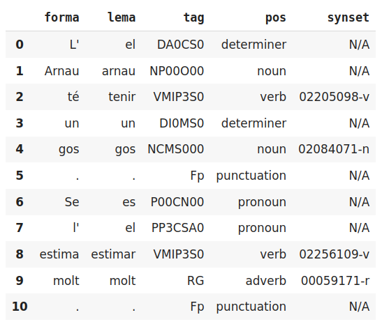

class: center, middle

## Processament del Llenguatge Humà

# Lab.5: nivell lèxic - semàntica - <br> desambiguació de sentits

### Gerard Escudero

## Grau en Intel·ligència Artificial

<br>


---
class: left, middle, inverse

# Outline

- .cyan[Documentació]

  - .cyan[Lesk amb NLTK]

  - UKB amb TextServer

- Pràctica

  - UKB i SentiWornet

---

# Lesk in NLTK

**Requeriments**:

```python3
import nltk
nltk.download('wordnet')
nltk.download('omw-1.4')
```

**Ús**:

```python3
context = ['I', 'went', 'to', 'the', 'bank', 'to', 'deposit', 'money', '.']

synset = nltk.wsd.lesk(context, 'bank', 'n')
```

**Resultat**:

```python3
synset.name(), synset.definition()
👉
('savings_bank.n.02',
 'a container (usually with a slot in the top) for keeping money at home')
```

---
class: left, middle, inverse

# Outline

- .cyan[Documentació]

  - .brown[Lesk amb NLTK]

  - .cyan[UKB amb TextServer]

- Pràctica

  - UKB i SentiWornet

---

# UKB amb TextServer I

### Requeriments

- Script auxiliar: [textserver.py](../codes/textserver.py)

```
from google.colab import drive
import sys

drive.mount('/content/drive')
sys.path.insert(0, '/content/drive/My Drive/Colab Notebooks/plh')
from textserver import TextServer
```

---

# UKB amb TextServer II

### Ús

```
ts = TextServer('usuari', 'passwd', 'senses') 

ts.senses("L'Arnau té un gos. Se l'estima molt.")
👉
[[["L'", 'el', 'DA0CS0', 'determiner', 'N/A'],
  ['Arnau', 'arnau', 'NP00O00', 'noun', 'N/A'],
  ['té', 'tenir', 'VMIP3S0', 'verb', '02205098-v'],
  ['un', 'un', 'DI0MS0', 'determiner', 'N/A'],
  ['gos', 'gos', 'NCMS000', 'noun', '02084071-n'],
  ['.', '.', 'Fp', 'punctuation', 'N/A']],
 [['Se', 'es', 'P00CN00', 'pronoun', 'N/A'],
  ["l'", 'el', 'PP3CSA0', 'pronoun', 'N/A'],
  ['estima', 'estimar', 'VMIP3S0', 'verb', '02256109-v'],
  ['molt', 'molt', 'RG', 'adverb', '00059171-r'],
  ['.', '.', 'Fp', 'punctuation', 'N/A']]]
```

---

# UKB a TextServer III

### Ús amb pandas

```
ts.senses("L'Arnau té un gos. Se l'estima molt.", pandas=True)
👉  
```


---
class: left, middle, inverse

# Outline

- .brown[Documentació]

  - .brown[Lesk amb NLTK]

  - .brown[UKB amb TextServer]

- .cyan[Pràctica]

  - .cyan[Detecció d'opinions]

---

# Detecció d'opinions (pràctica 2.b)

#### Enunciat

* Implementeu un detector d'opinions positives o negatives no supervisat
  1. Apliqueu l'UKB per obtenir els synsets de les paraules
  2. Obtingueu els valors SentiWordnet de cada synset

* Utilitzeu com a dades el/els conjunts de test que hagueu utilitzat a la pràctica 2.a

* Penseu en com podeu combinar aquests valors per obtenir un resultat

* Penseu que fareu si el synset no hi és a SentiWordnet

* Penseu quines categories utilitzareu:
  - només adjectius
  - noms, adjectius i adverbis
  - noms, adjectius, verbs i adverbis

* Analitzeu els resultats i compareu-los amb els de la part supervisada


